# 操作系统专题实验

## 实验一
### 设置

  实验一的目标是掌握操作系统的基本内容，以及熟悉华为OpenEuler的使用方法，并进行简单的线程操作。首先，需要对云服务器进行设置。由于当前位置距离北京较远，我选择了墨西哥城服务器进行实验。
  
  进入云服务器后，我创建了一个新的用户。步骤如下：
[root@kp-test01 ~]# useradd -m -s /bin/bash week

[root@kp-test01 ~]# passwd week

[root@kp-test01 ~]# usermod -aG wheel week

[root@kp-test01 ~]# su - week

[week@kp-test01 ~]$ ls

[week@kp-test01 ~]$ /bin/bash -c 

[week@kp-test01 ~]$ sudo yum install git -y

输入以下指令进入服务器用户week空间：ssh week@122.8.179.172

创建文件夹 mkdir proj1

[week@kp-test01 ~]$ cd proj1

### 1-1 
  实验一的实验目标是熟悉 Linux 操作系统的基本环境和操作方法，通过运行系统命令查看系统基本信息以了解系统。同时，需要编写并运行简单的进程调度相关程序，体会进程调度、进程间变量的管理等机制在操作系统实际运行中的作用。

  步骤1是添加一个全局变量并在父进程和子进程中对这个变量做不同操作，并输出操作结果。
  
  实验1-1步骤一代码：
  
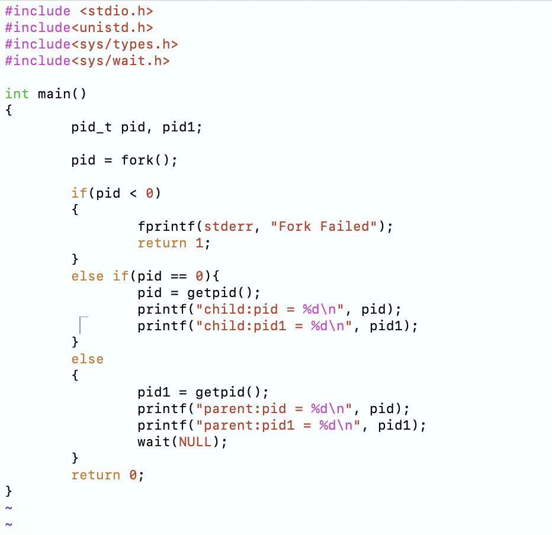

  实验一步骤一运行结果：
  
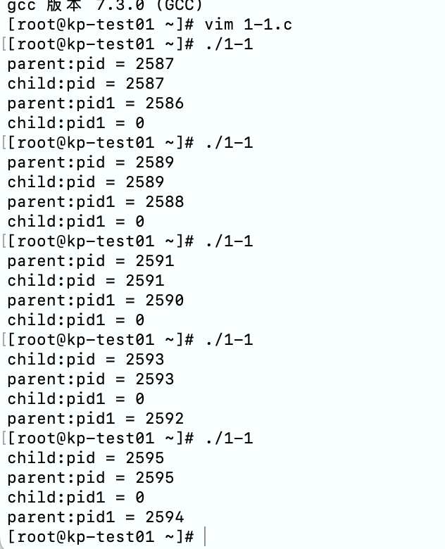

  1-1步骤二去除wait结果：
  
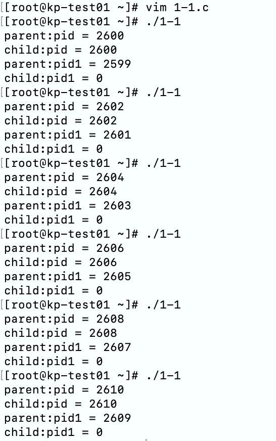

  1-1步骤三代码：
  
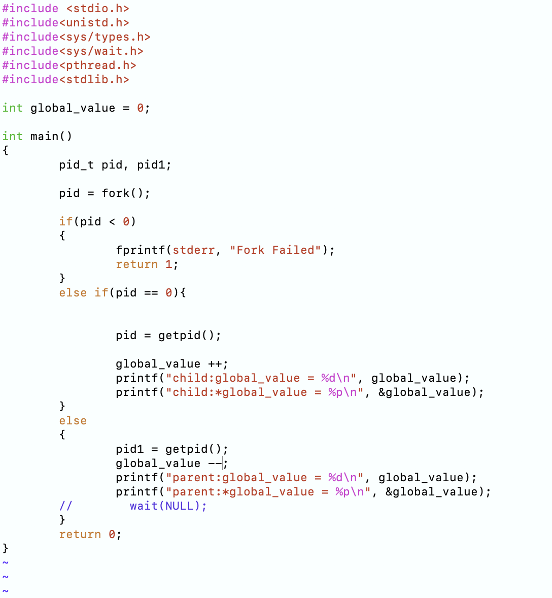

  1-1步骤三结果：
  
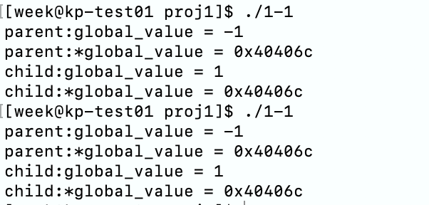

  1-1步骤四代码：
  

  1-1步骤四运行结果：
  

  1-1-5-e代码:
  
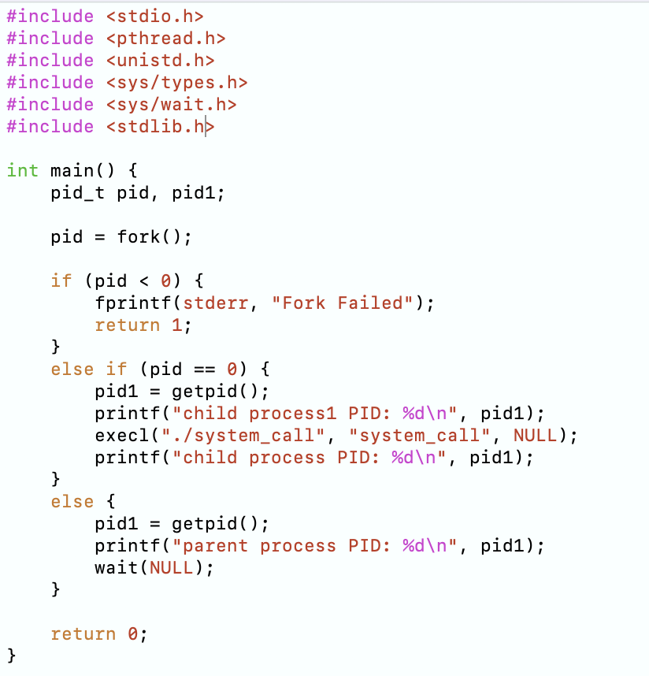

  1-1-5-s代码:
  
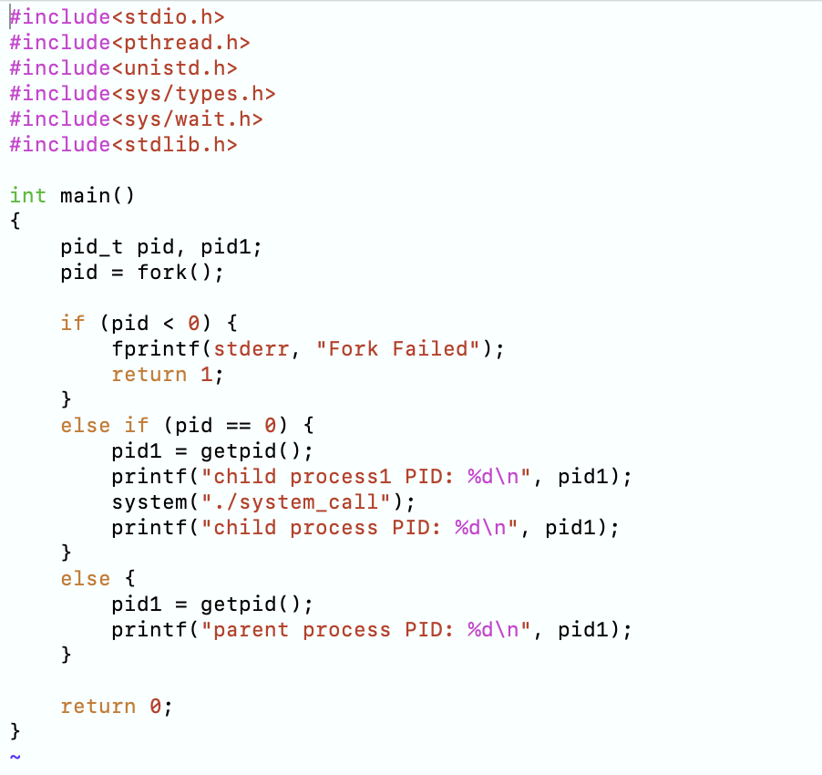

  1-1-5运行结果:
  
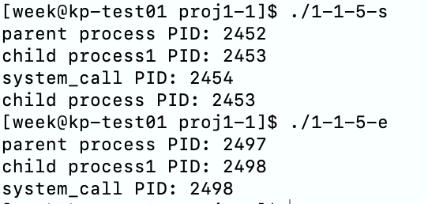

### 1-2
实验1-2是用于探究多线程编程中的线程共享进程信息。在计算机编程中，多线程是一种常见的并发编程方式，允许程序在同一进程内创建多个线程，从而实现并发执行。由于这些线程共享同一进程的资源，包括内存空间和全局变量，因此可能会出现线程共享进程信息的现象。本实验旨在通过创建多个线程并使其共享进程信息，以便深入了解线程共享资源时可能出现的问题。

  实验1-2-1代码：
  
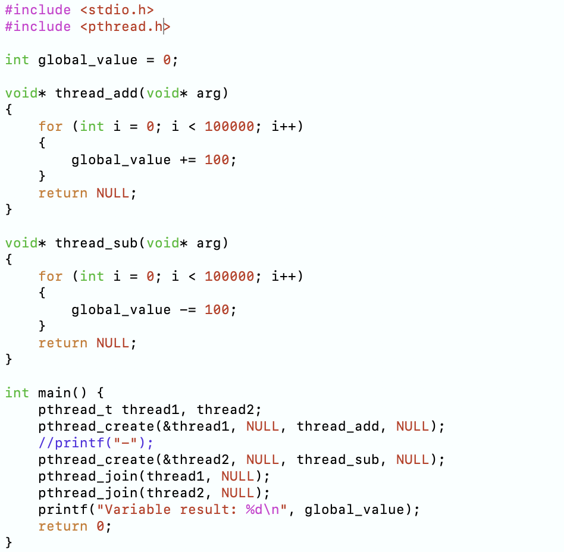

  实验1-2-1结果：
  
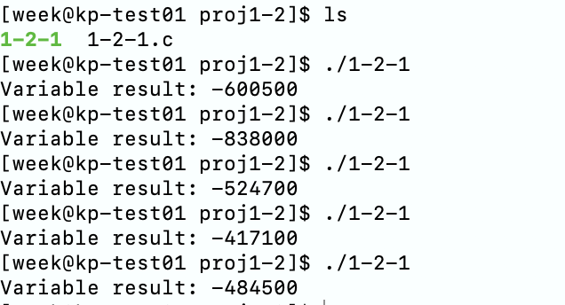

  实验1-2-2代码：
  
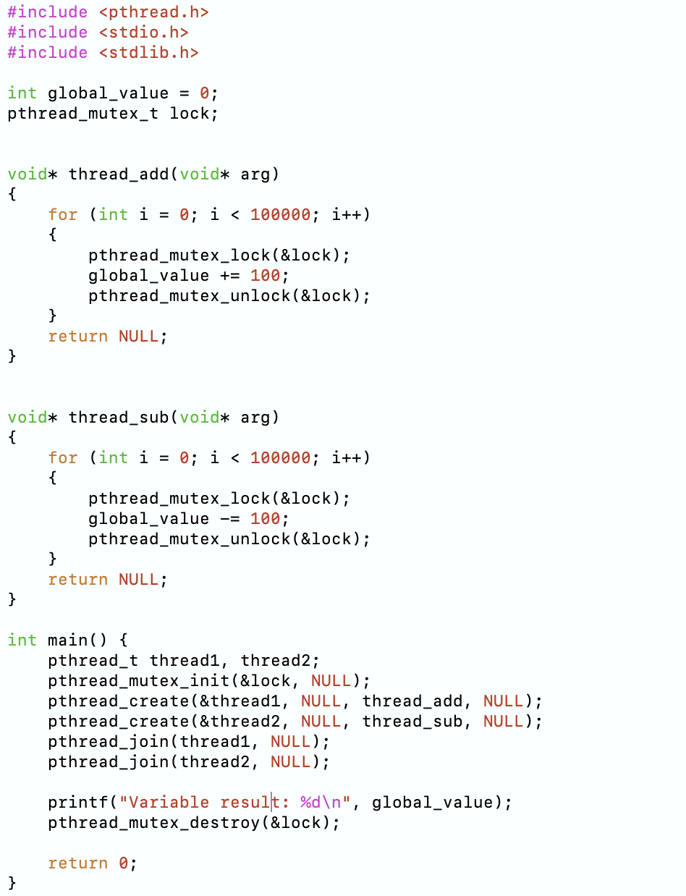

  实验1-2-2结果：
  
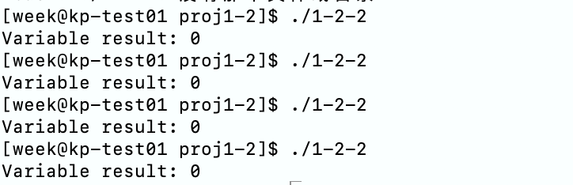

  实验1-2-3-e代码：
  
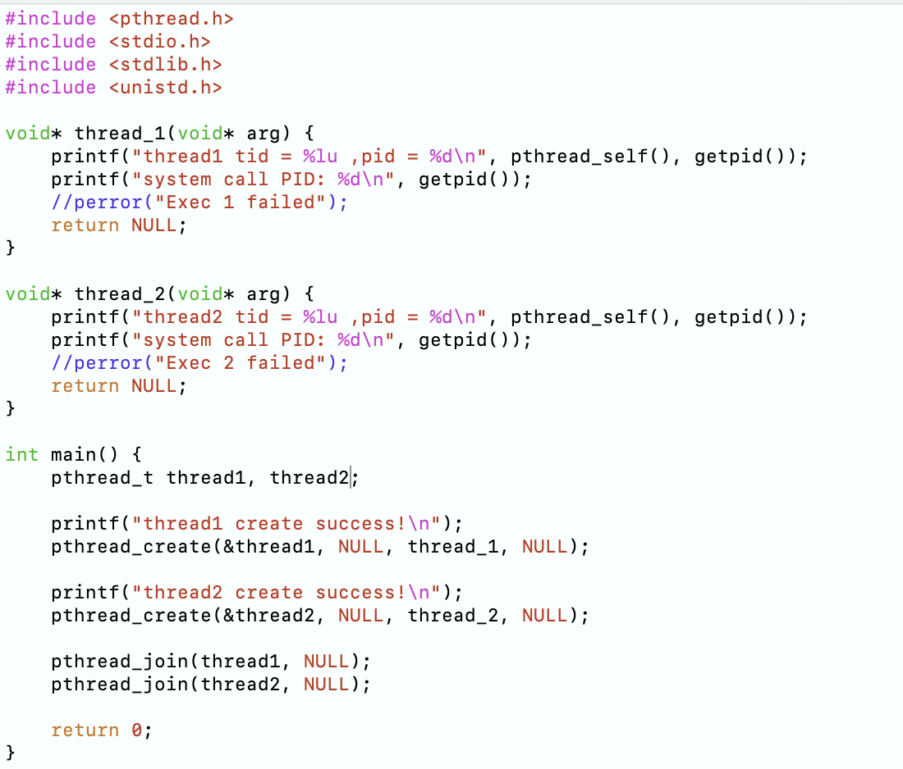

  实验1-2-3-e结果：
  
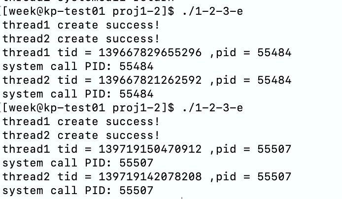

  实验1-2-3-sys代码：
  
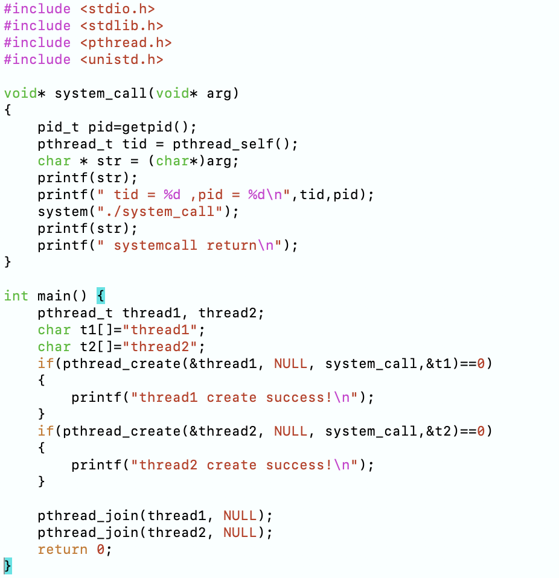

  实验1-2-3-sys结果：
  
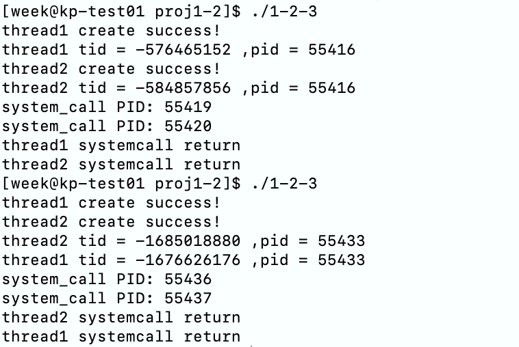

### 1-3
自旋锁作为一种并发控制机制，可以在特定情况下提高多线程程序的性能。本实验旨在通过设计一个多线程的实验环境，以及使用自旋锁来实现线程间的同步。

  实验1-3代码：
  
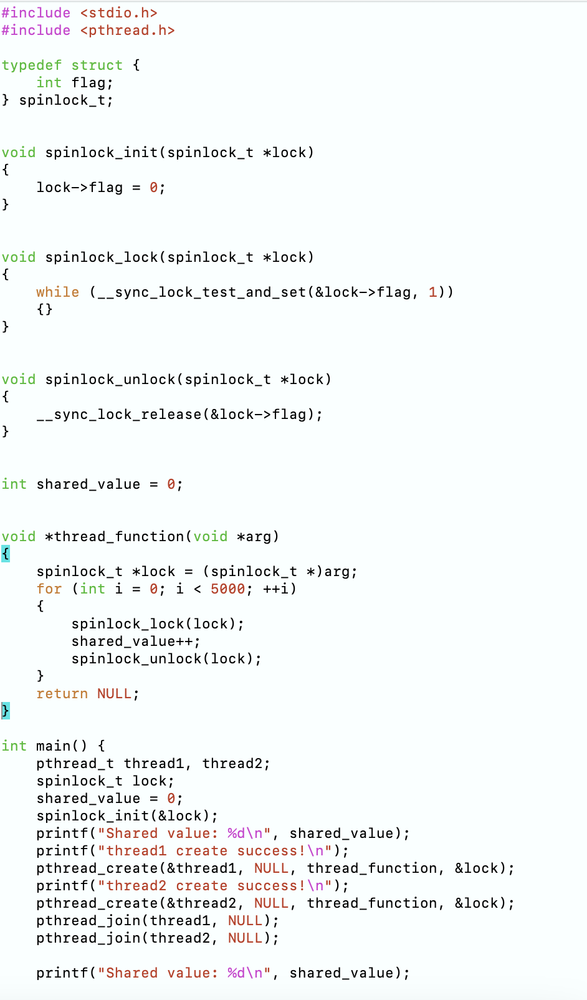

  实验1-3结果：
  
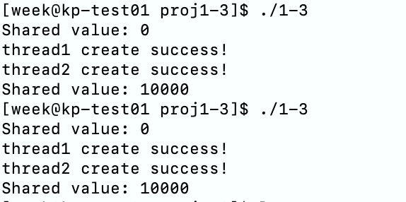
