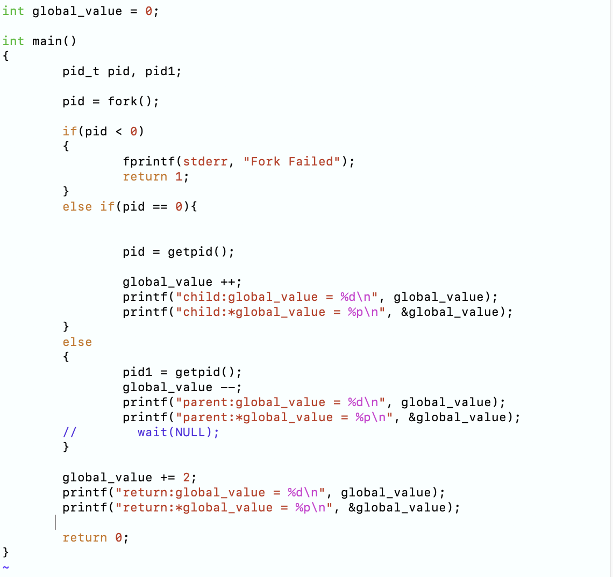

# 操作系统专题实验

## 实验一
### 设置

  实验一的目标是掌握操作系统的基本内容，以及熟悉华为OpenEuler的使用方法，并进行简单的线程操作。首先，需要对云服务器进行设置。由于当前位置距离北京较远，我选择了墨西哥城服务器进行实验。
  
  进入云服务器后，我创建了一个新的用户。步骤如下：
[root@kp-test01 ~]# useradd -m -s /bin/bash week

[root@kp-test01 ~]# passwd week

[root@kp-test01 ~]# usermod -aG wheel week

[root@kp-test01 ~]# su - week

[week@kp-test01 ~]$ ls

[week@kp-test01 ~]$ /bin/bash -c 

[week@kp-test01 ~]$ sudo yum install git -y

输入以下指令进入服务器用户week空间：ssh week@122.8.179.172

创建文件夹 mkdir proj1

[week@kp-test01 ~]$ cd proj1

### 1-1 
  实验一的实验目标是熟悉 Linux 操作系统的基本环境和操作方法，通过运行系统命令查看系统基本信息以了解系统。同时，需要编写并运行简单的进程调度相关程序，体会进程调度、进程间变量的管理等机制在操作系统实际运行中的作用。

  步骤1是添加一个全局变量并在父进程和子进程中对这个变量做不同操作，并输出操作结果。pid = fork()：创建子进程。返回值 pid 在父进程中是子进程的 PID（大于 0），在子进程中是 0，若小于 0 则表示创建进程失败。
如果 pid == 0，则进入子进程分支：
pid = getpid()：通过 getpid() 获取子进程自己的 PID，并赋值给 pid。
printf("child:pid = %d\n", pid);：打印子进程实际的 PID。
printf("child:pid1 = %d\n", pid1);：此时 pid1 在子进程里尚未被显式赋值（从父进程拷贝过来时有初始值，但在这里其实是和父进程中声明同名变量“分家”了），所以它可能是 0 或未定义的值；不过一般情况下由于 fork() 复制了父进程的地址空间，子进程这边的 pid1 会是父进程中 pid1 的原值，但没有经过“新”赋值。
如果 pid > 0，则进入父进程分支：
pid1 = getpid()：获取父进程自身 PID。
printf("parent:pid = %d\n", pid);：此时 pid 是 fork() 的返回值，也就是子进程的 PID。
printf("parent:pid1 = %d\n", pid1);：这里就打印父进程自己的 PID。
wait(NULL);：父进程等待子进程执行结束。

要点： 这段代码主要演示了 fork() 返回值在父子进程中的区别，以及父子进程如何各自维护变量（但初始值拷贝自同一地址空间）。
  
  实验1-1步骤一代码：
  

  实验一步骤一运行结果：
  

  1-1步骤二去除wait结果：
  

  1-1步骤三代码：这里在全局作用域定义了一个全局变量 global_value 并初始化为 0。
fork() 之后，父子进程会各自拥有这块全局变量的副本，因为 fork() 会复制当前进程的地址空间。
在子进程中执行 global_value++，在父进程中执行 global_value--。由于两者的内存空间已经分离，对 global_value 的修改不会影响对方。
打印出的地址 &global_value（使用 %p）在父子进程各自的进程空间里虽然数值可能相同或相似，但本质上是不同的物理内存页面。也正是通过这种“写时复制” (Copy on Write) 机制，子进程只有真正写入内存时，才会把这部分内存重新映射到自己的物理页上。
要点： 这个示例清晰展示了 “父子进程不共享（写时）内存”的典型特征。改动全局变量在各自进程中互不影响。
  

  1-1步骤三结果：
  

  1-1步骤四代码：fork() 后，父子进程拥有各自的global_value 副本：
子进程在分支处给 global_value++（从 0 变为 1），然后再执行 global_value += 2（变为 3）并打印。
父进程在分支处给 global_value--（从 0 变为 -1），然后再执行 global_value += 2（变为 1）并打印。
因此，父子进程各自的 global_value 最终值并不相同。
虽然打印时 %p 显示的地址往往看起来相同或相似，但实际上在操作系统层面是不同的物理内存；子进程的地址空间是通过“写时复制”(Copy-on-Write)从父进程复制过来的，一旦写入就各行其是。
如果父进程里调用了 wait(NULL)，则父进程会等待子进程执行完再继续执行；若未调用，父进程可能更快执行到最后的打印，也就会看到两份输出先后顺序不一定。
  

  1-1步骤四运行结果：
  

  1-1-5-e代码:fork() 一样地将进程分成父、子两条分支。
子进程中调用 execl("./system_call", "system_call", NULL)，其含义是：用当前进程替换为可执行文件 ./system_call，并传入命令行参数（这里就是 "system_call"）。如果替换成功，子进程的代码段会被新程序覆盖，后面的 printf 不会再执行。
父进程依旧会 wait(NULL) 等待子进程结束。
这段代码主要演示了 子进程通过 execl() 去执行另一个程序 的方式。如果想在子进程里执行一个新程序且不返回，execl（或 execvp、execv 等）都是常用方式。
  

  1-1-5-s代码:与上一个示例的区别在于，子进程里使用 system() 来执行外部命令，而不是 execl()。
system() 的内部实现会再 fork() 一个临时子进程，并用 /bin/sh -c "命令" 的方式来执行给定字符串命令。执行完后，system() 会等待这个临时子进程退出，然后再回到原本的子进程中继续执行。
因此，这里的 “child process” 会先打印一次 PID，执行 system("./system_call")，返回后再打印一次 PID。相对于 execl() 来说，system() 并不会把当前进程“替换掉”，而是额外多做了一层 shell 调用。
  

  1-1-5运行结果:
  

### 1-2
实验1-2是用于探究多线程编程中的线程共享进程信息。在计算机编程中，多线程是一种常见的并发编程方式，允许程序在同一进程内创建多个线程，从而实现并发执行。由于这些线程共享同一进程的资源，包括内存空间和全局变量，因此可能会出现线程共享进程信息的现象。本实验旨在通过创建多个线程并使其共享进程信息，以便深入了解线程共享资源时可能出现的问题。

  实验1-2-1代码：与 fork() 不同，线程是同一进程内的多个执行流，因此共享同一个全局变量 global_value。
thread_add() 会不断执行 global_value += 100；thread_sub() 会不断执行 global_value -= 100。理想情况下，如果先加后减（或者顺序执行），可能得到 0；但是由于这两段加减操作是并发进行，没有使用任何锁或原子操作，容易出现“竞态条件”（race condition）。
运行多次后，你可能会发现 global_value 的结果不一定是 0——这就是多线程并发写共享变量时经常会碰到的问题，需要加锁或使用原子操作来保证一致性。
  

  实验1-2-1结果：
  

  实验1-2-2代码：
  

  实验1-2-2结果：
  

  实验1-2-3-e代码：分别创建了两个线程 thread1、thread2；
每个线程里都会打印自己的线程 ID（pthread_self()）与进程 ID（getpid()）。
不同线程的 TID 互不相同，而 getpid() 打印出的进程 ID 在同一个进程里是相同的；这说明同一个进程可以拥有多个线程，每个线程有独立的线程 ID，但共享一个进程 ID。
  

  实验1-2-3-e结果：
  

  实验1-2-3-sys代码：两个线程分别传入不同的字符串（"thread1"、"thread2"）给函数 system_call()。
system_call() 内部调用 system("./system_call") ，这会再启动一个外部程序（名字也叫 system_call），相当于让操作系统用 bash/sh 来执行这一命令；执行完毕后再回到该线程并打印“systemcall return”。
这演示了：
在同一个进程的不同线程里可以分别去运行外部命令；
每个线程都有各自的线程 ID，但共享同一个进程 ID；
system() 会新建一个子进程去执行命令，而调用者线程会等待该子进程完成后再继续。
  

  实验1-2-3-sys结果：
  

### 1-3
自旋锁作为一种并发控制机制，可以在特定情况下提高多线程程序的性能。本实验旨在通过设计一个多线程的实验环境，以及使用自旋锁来实现线程间的同步。

  实验1-3代码：定义了一个自旋锁结构体 spinlock_t，只包含一个整型 flag。
spinlock_lock() 使用 __sync_lock_test_and_set 将 flag 原子地置为 1，如果锁已被占用（返回值是 1），就一直“自旋”在 while 循环里等待。
spinlock_unlock() 使用 __sync_lock_release 把 flag 置回 0。
shared_value 是需要被保护的共享变量，两个线程各自循环 5000 次对它做 ++；在每次操作前后用自旋锁保护。
和互斥锁类似，只是自旋锁忙等待（不断循环测试）而不进入阻塞状态，适合锁持有时间很短、对性能有特殊需求的场景。
  

  实验1-3结果：
  

