# 操作系统专题实验

## 实验二
### 2-1
  编程实现进程的创建和软中断通信，通过观察、分析实验现象，深入理解进程及进程
  在调度执行和内存空间等方面的特点，掌握在POSIX 规范中系统调用的功能和使用。

  实验2-1代码：用 fork() 生成两个子进程：pid1、pid2。
在父进程中，通过 kill(pid1, SIGQUIT) 或 kill(pid2, SIGURG) 等方式发送信号给子进程。
在子进程中，通过 signal(SIGQUIT, inter_handler)/signal(SIGURG, inter_handler) 来注册信号处理函数，一旦收到相应信号，就会调用特定的处理逻辑。
waitpid(...) 用于父进程等待子进程结束。
该示例主要演示：父进程和子进程之间如何用信号进行通信和控制，以及在子进程里如何设置并响应特定信号。
  

  实验2-1结果：
  
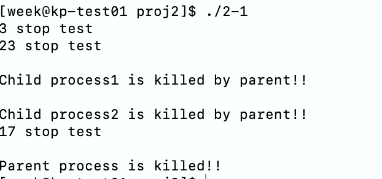

### 2-2
  编程实现进程的管道通信，通过观察、分析实验现象，深入理解进程管道通信的特点，
掌握管道通信的同步和互斥机制。

  实验2-2-unlock代码：
  
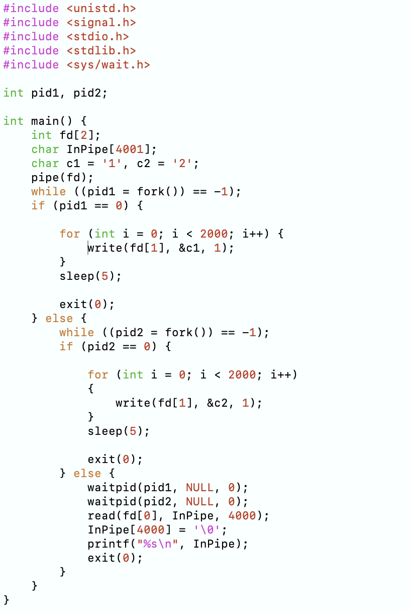

  实验2-2-unlock结果：
  

  实验2-2-lock代码：
  
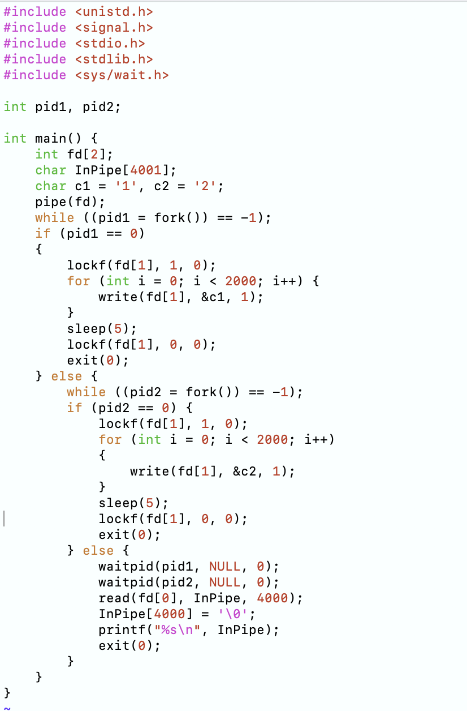

  实验2-2-lock结果：
  

### 2-3
  通过设计实现内存分配管理的三种算法（FF，BF，WF），理解内存分配及回收的过程及
实现思路，理解如何提高内存的分配效率和利用率。

  FF算法代码：从空闲块链表的头部开始查找，找到第一个能满足需求的空闲块即进行分配。如果剩余空间足够大，则分割；否则将整块分配。简单高效，分配速度快，适合空闲块分布均匀、申请频繁的情况。容易在内存前部产生大量小的碎片，导致空闲块利用率降低。
  
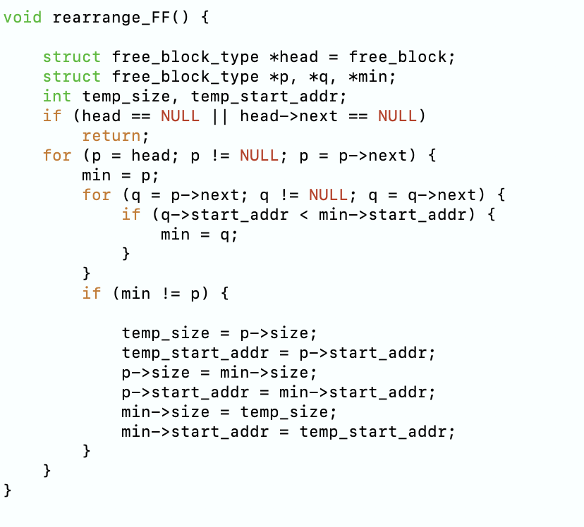

  BF算法代码：查找空闲块链表，选择能满足需求且最小的空闲块进行分配，以减少分配后的剩余空间量。能最大限度减少分配后的剩余空间，降低碎片化程度。查找过程较慢，容易产生大量无法使用的小碎片，尤其在频繁分配/释放时。
  
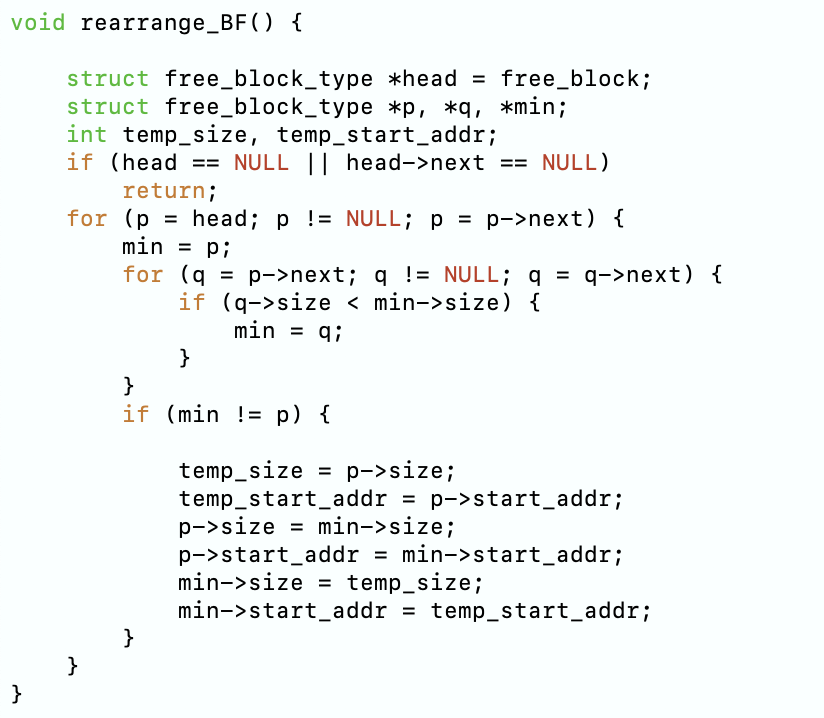

  FF算法代码：查找空闲块链表，选择最大的空闲块进行分配，以尽量减少生成新的小碎片的可能性。有助于保留大块空闲空间，适合需要大块连续内存的场景。剩余空间过小，可能会频繁分配和回收，导致整体利用率降低。
  
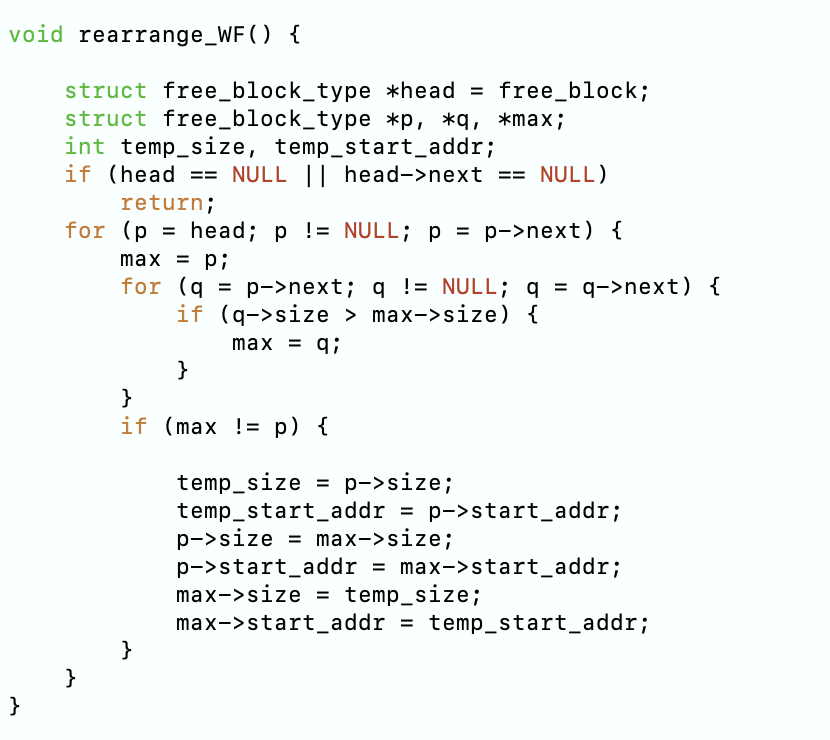

  实验步骤：
  
  将内存大小设置为1000：
  
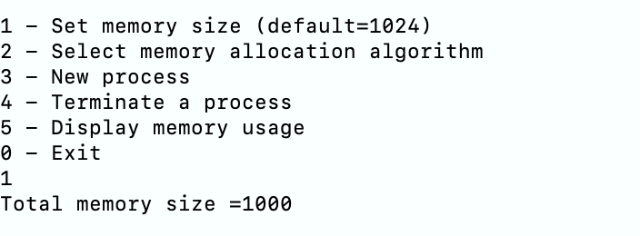

  使用FF算法：
  
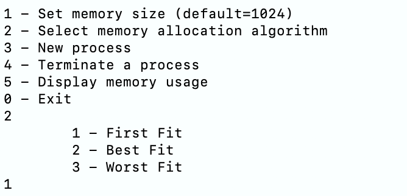

  创建两个大小为100和600的进程：
  
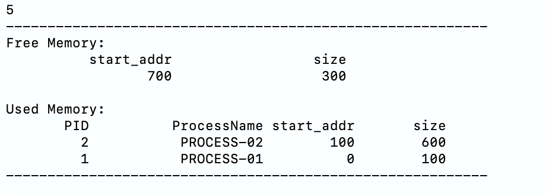

  再次尝试创建大小为400的进程时发现失败：
  

  现创建一个700-800的进程并删除前面的所有进程：
  
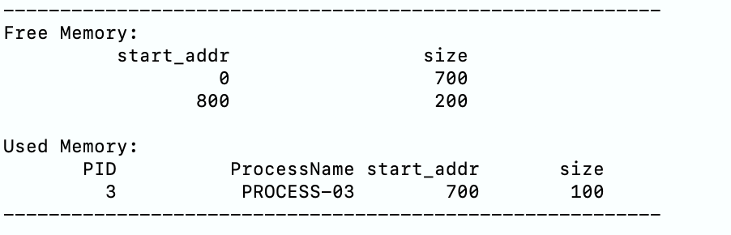

  再创建新的进程，发现它们按照FF算法分配内存：
  
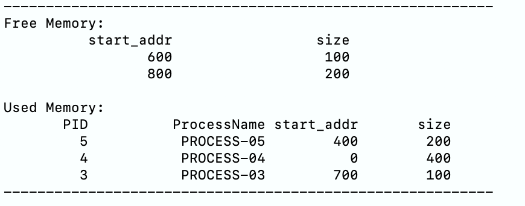

  这次使用BF算法，发现它们按照BF算法分配内存：
  
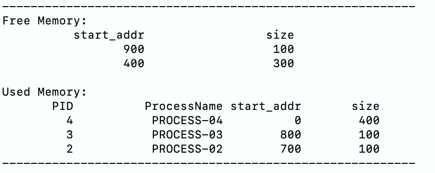

  这次使用WF算法，发现它们按照WF算法分配内存：
  
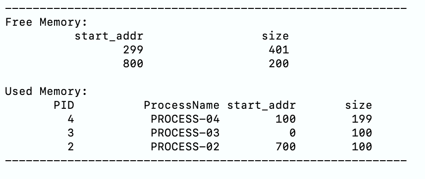
