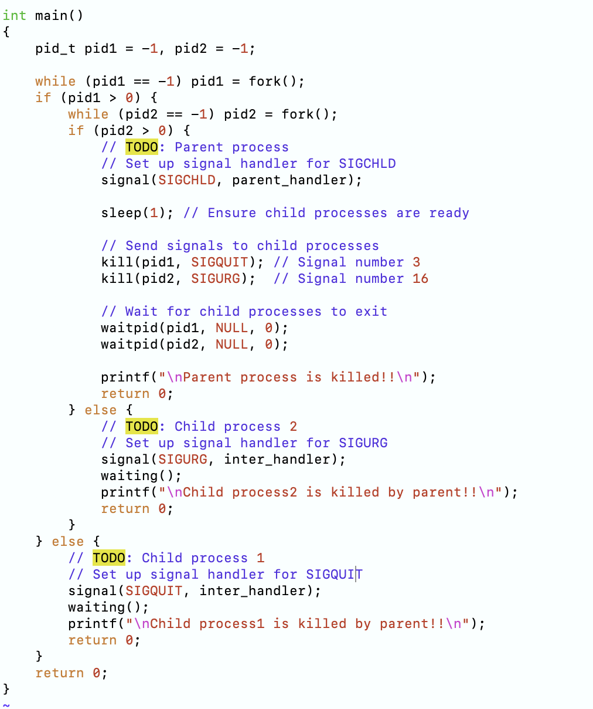

# 操作系统专题实验

## 实验二
### 2-1
  编程实现进程的创建和软中断通信，通过观察、分析实验现象，深入理解进程及进程
  在调度执行和内存空间等方面的特点，掌握在POSIX 规范中系统调用的功能和使用。

  实验2-1代码：
  

  实验2-1结果：
  

### 2-2
  编程实现进程的管道通信，通过观察、分析实验现象，深入理解进程管道通信的特点，
掌握管道通信的同步和互斥机制。

  实验2-2-unlock代码：
  

  实验2-2-unlock结果：
  

  实验2-2-lock代码：
  

  实验2-2-lock结果：
  

### 2-3
  通过设计实现内存分配管理的三种算法（FF，BF，WF），理解内存分配及回收的过程及
实现思路，理解如何提高内存的分配效率和利用率。

  FF算法代码：
  

  BF算法代码：
  

  FF算法代码：
  

  实验步骤：
  
  将内存大小设置为1000：
  

  使用FF算法：
  

  创建两个大小为100和600的进程：
  

  再次尝试创建大小为400的进程时发现失败：
  

  现创建一个700-800的进程并删除前面的所有进程：
  

  再创建新的进程，发现它们按照FF算法分配内存：
  

  这次使用BF算法，发现它们按照BF算法分配内存：
  

  这次使用WF算法，发现它们按照WF算法分配内存：
  

