# 操作系统专题实验

## 实验三
### 模拟ext2系统基本概念
  本项目实际上是一个极简版的类EXT2文件系统的实现，通过一个磁盘文件weekends.img
来模拟真正的磁盘，并在其上管理简单的 inode、数据块、目录等结构。

### 代码实现
  本项目实际上是一个简化版的类EXT2文件系统的实现，通过一个磁盘文件weekends.img
  来模拟真正的磁盘，并在其上管理简单的 inode、数据块、目录等结构。
  
#### 1.使用的数据结构与数据结构设计

  GroupDesc：在本项目中只定义一个组。GroupDesc只占用一个“块”。同时，超级块省略，其功能由组描述符块代替，包括了需要增加的卷名、文件系统大小以及索引结点的大小等。它的具体实现形式如下：
  
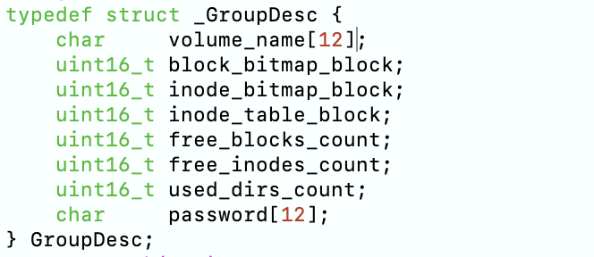

  Inode：在EXT2文件系统中,索引节点inode用于描述一个文件或目录的基本信息。为了简化，本项目仅实施了一部分：
  

  DirEntry：用于目录的数据块中，存储单个文件或子目录的基本信息。“目录”就是由若干个 DirEntry 依次排列构成：
  

#### 2.内存的分配与释放

  allocate_inode:从 inode 位图中分配或释放一个 inode 编号,先加载组描述符，
  检查 free_inodes_count 是否为 0, 
  从 inode bitmap 里调用 bitmap_find_zero 找到空位,
  将该位翻转为 1，表示已占用；更新 inode bitmap 到磁盘,
  组描述符 free_inodes_count-- 并写回磁盘。
  
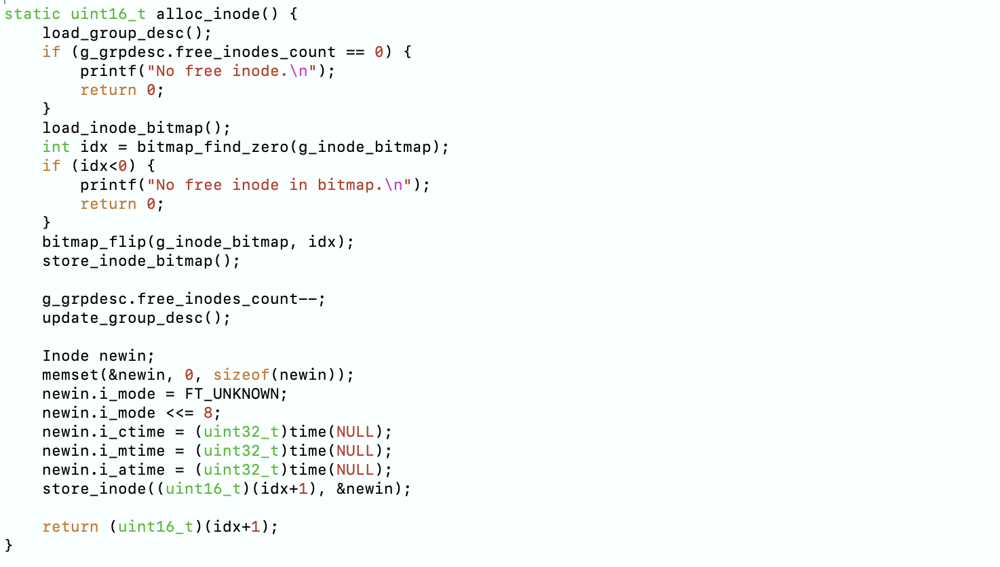

  free_inode：
  
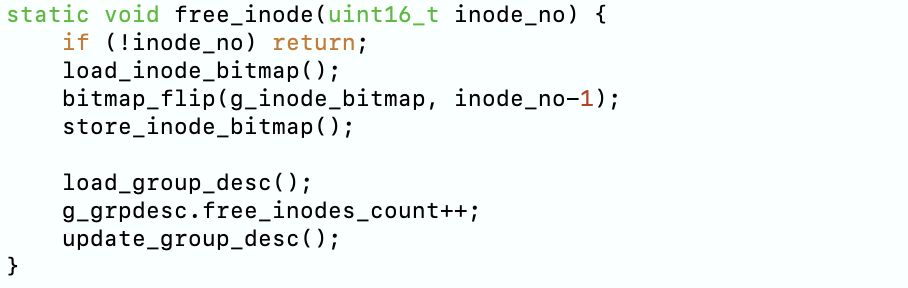

  alloc_free_block：类似于alloc_free_inode, 分配时找空闲位、置 1 并把块内容清零；释放则置 0 。
  
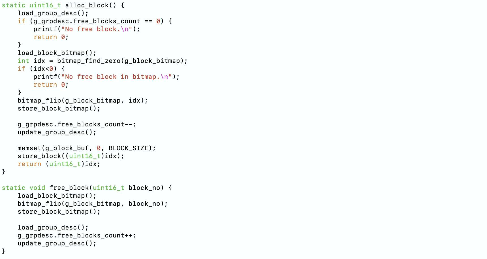

#### 3.初始化

  init_disk_file：把所有磁盘块写零；
  写入组描述符；
  分配第一个 inode 作为根目录 root_ino=1；
  为根目录分配一个数据块，并在其中写入 “.” 和 “..” 两个目录项；
  更新根目录 inode 大小、时间，组描述符等
  
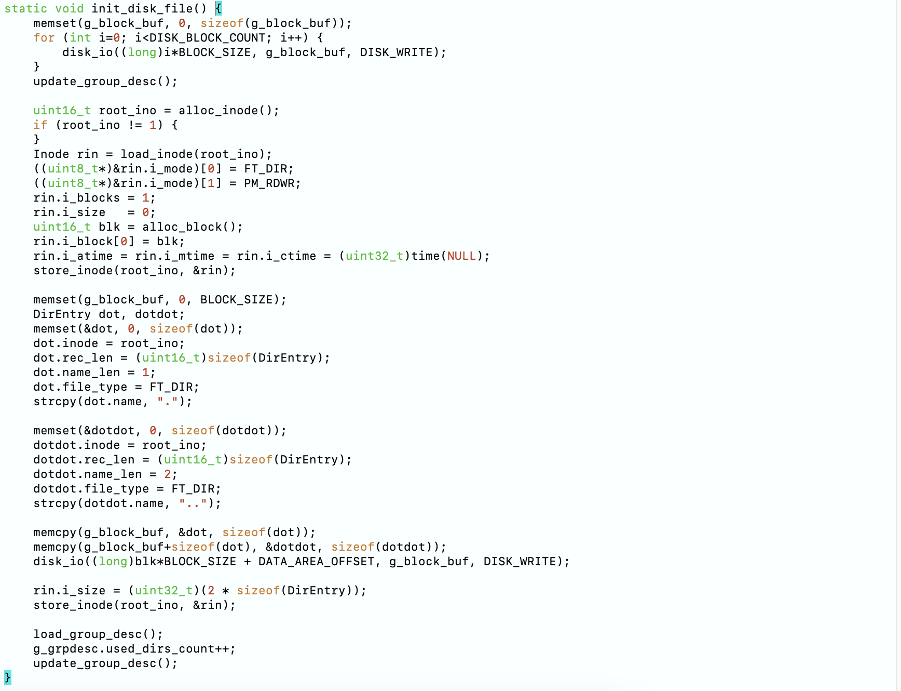

  init_memory：初始化内存中的全局变量，包括组描述符、打开表、当前目录、当前路径等。
  
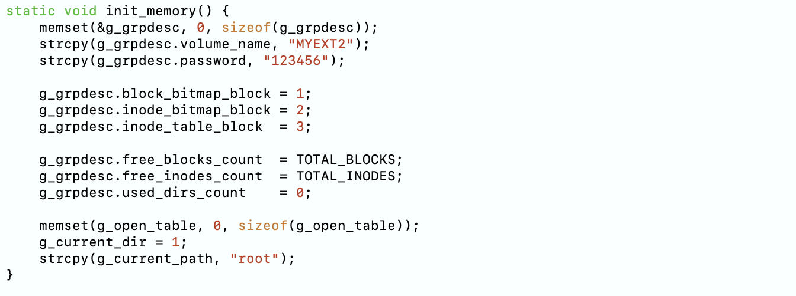

#### 4.命令函数

shell_loop：在交互式环境中解析用户输入的命令行，分发给对应函数执行。输入 quit 则退出循环。

login指令：

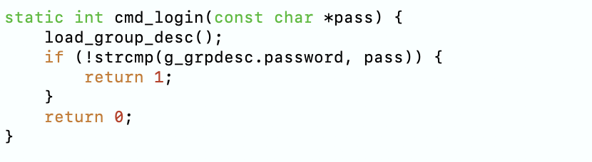

change_password指令：

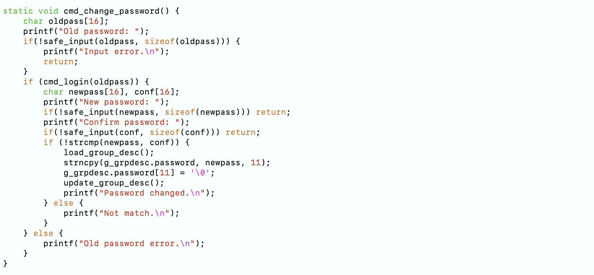

format指令：

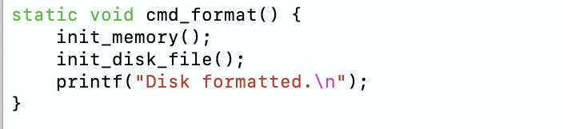

check指令：

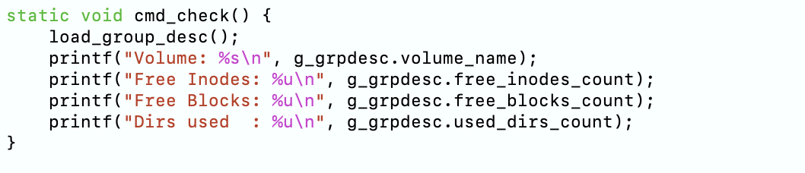

ls指令：

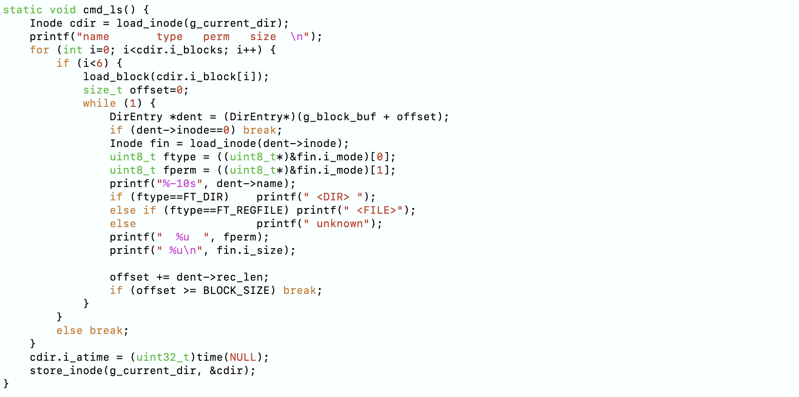

mkdir指令：

rmdir指令：

create指令：

delete指令：

cd指令：

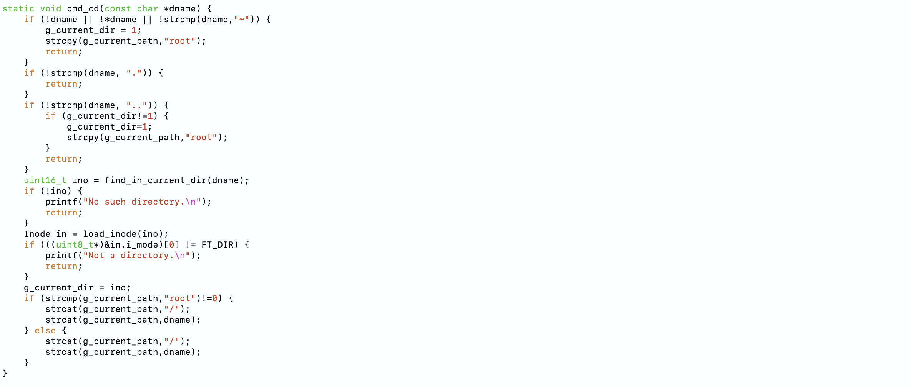

chmod指令：

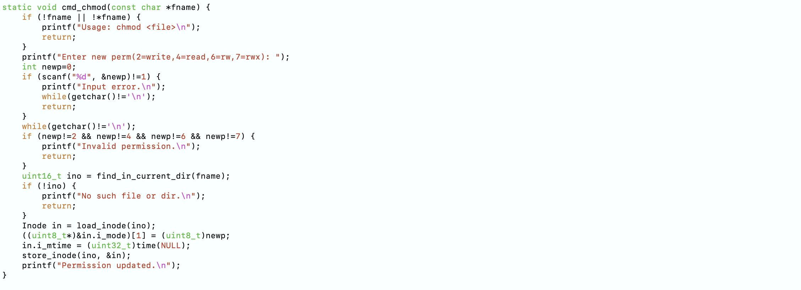

open指令：

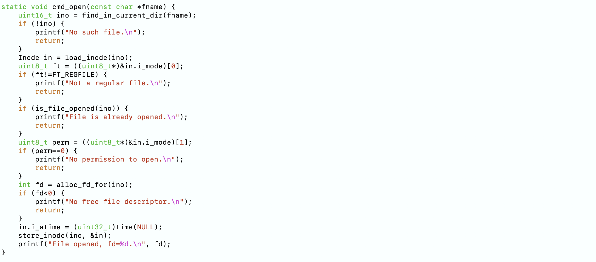

close指令：

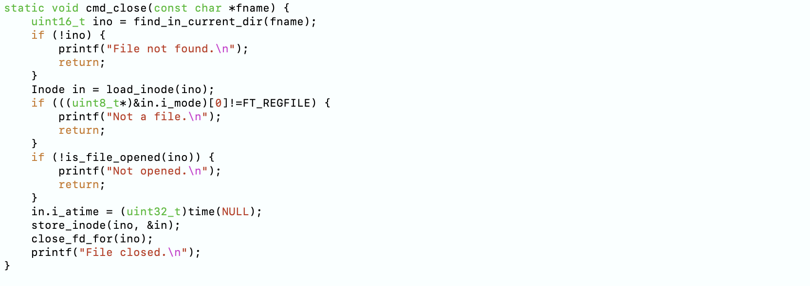

write指令：

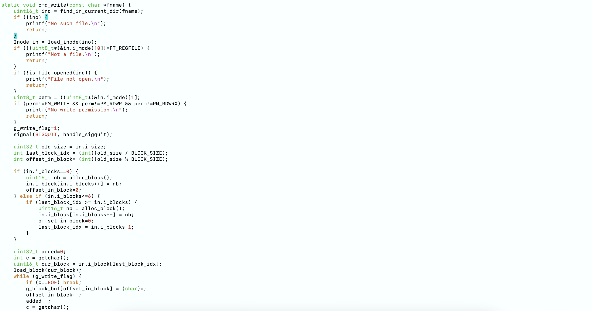

read指令：

#### 5.main函数

main函数：打开/创建模拟磁盘文件 ext2_disk.img；
如果文件是新建或检测到无效文件系统，则进行格式化；
要求用户输入密码通过 cmd_login 认证；
进入命令行循环交互；
退出时关闭磁盘文件并结束程序。

### 实验改进
####使用SIMD加速
SIMD，Single Instruction, Multiple Data，是一种并行计算技术，可在单个指令周期内对多个数据进行相同的操作。
常用于多媒体处理、矩阵运算、图像处理等场景。对于本实验，可以用它来加速for语句和可以并行的结构。

使用SIMD修改部分函数：

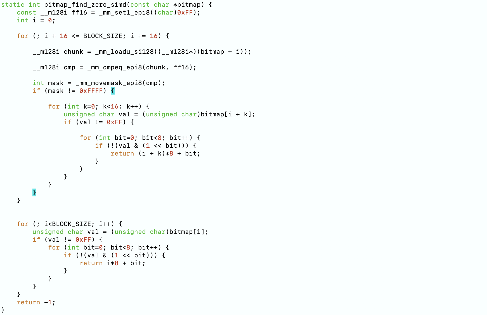

####使用OpenMP加速
OpenMP是一个支持多线程并行编程的 API，广泛应用于共享内存多处理器系统中。通过简单的编译指令和函数调用，开发者可以快速将代码并行化，实现线程分配、任务划分、同步控制等功能。对于本实验，可以用它来加速for语句和可以并行的结构。

使用OpenMP修改部分函数：

### 实验结果呈现

login_quit：

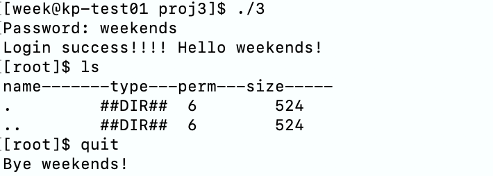

错误指令发现：

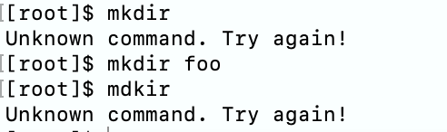

create_file：

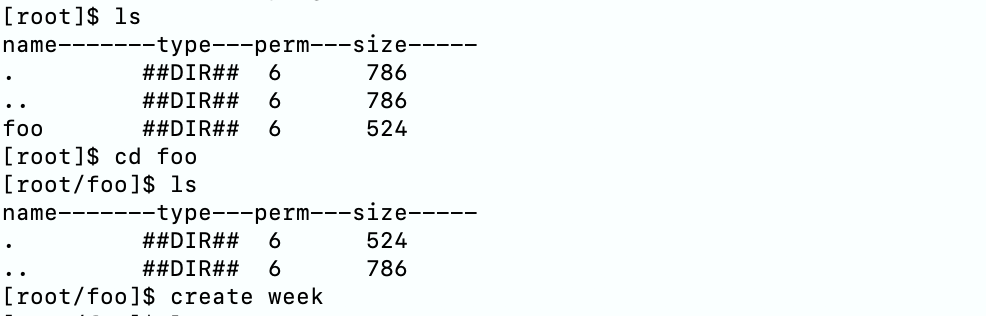

ls_cd：

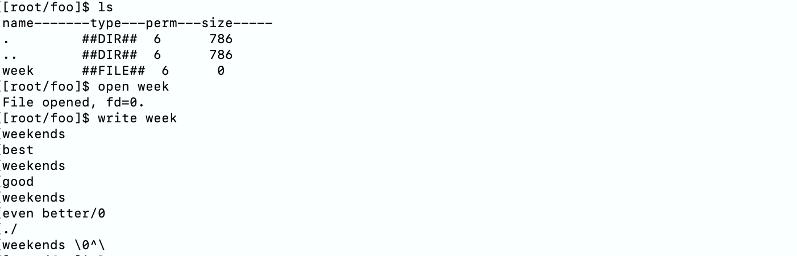

file_write：

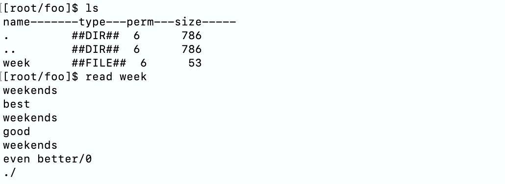

file_read：

